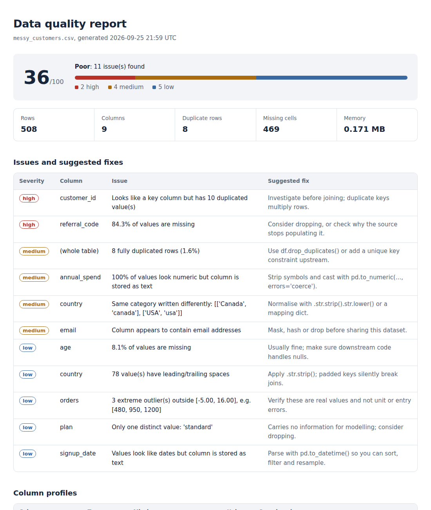

# datascout

**Find data quality problems in seconds, and get told how to fix them.**

[](https://github.com/YOUR-USERNAME/datascout/actions/workflows/ci.yml)


Every data project starts the same way: you receive a CSV, load it, and spend the next hour discovering that
`annual_spend` is stored as text, `"Canada"` and `"canada"` are counted separately, the "unique" customer ID
isn't unique, and a tenth of the rows are duplicates. Those problems usually surface *after* they've broken a join,
a dashboard, or a model.

`datascout` runs those checks up front with one command. It needs no config, no schema and no setup, and it
produces a report that tells you **what is wrong, where, how bad it is, and what to do about it**.

```bash
datascout customers.csv --html report.html
```



## Why use it

| You are a... | datascout helps you... |
|---|---|
| **Data analyst** | Sanity-check a new extract before building anything on top of it |
| **Data scientist** | Catch leakage-prone junk (constant columns, text-typed numbers, outliers) before modelling |
| **Data engineer** | Add a quality gate to a pipeline or CI job with `--fail-under` and JSON output |
| **Anyone sharing data** | Spot columns containing emails or phone numbers before you send the file |

## Install

```bash
git clone https://github.com/YOUR-USERNAME/datascout.git
cd datascout
pip install -e ".[parquet,excel]"
```

Only `pandas` is required. `pyarrow` (Parquet) and `openpyxl` (Excel) are optional extras.

## Quick start

Try it on the bundled messy dataset:

```bash
datascout examples/messy_customers.csv
```

```text
datascout report for messy_customers.csv
508 rows x 9 columns | 0.171 MB
Health score: 36/100 (Poor)
Issues: 2 high, 4 medium, 5 low

  HIGH   [customer_id] Looks like a key column but has 10 duplicated value(s)
         fix: Investigate before joining; duplicate keys multiply rows.
  HIGH   [referral_code] 84.3% of values are missing
         fix: Consider dropping, or check why the source stops populating it.
  MEDIUM 8 fully duplicated rows (1.6%)
         fix: Use df.drop_duplicates() or add a unique key constraint upstream.
  MEDIUM [annual_spend] 100% of values look numeric but column is stored as text
         fix: Strip symbols and cast with pd.to_numeric(..., errors='coerce').
  MEDIUM [country] Same category written differently: [['Canada', 'canada'], ['USA', 'usa']]
         fix: Normalise with .str.strip().str.lower() or a mapping dict.
  ...
```

Save the results in the format you need:

```bash
datascout data.parquet --html report.html   # shareable report for stakeholders
datascout data.parquet --md report.md       # paste into a PR, wiki or ticket
datascout data.parquet --json report.json   # feed into another tool or pipeline
```

## Use it from Python

```python
import pandas as pd
import datascout

df = pd.read_csv("sales.csv")
report = datascout.scan(df, name="sales.csv")

print(report.score)             # 0-100 health score
for issue in report.issues:     # structured Issue objects
    print(issue.severity, issue.column, issue.message, issue.suggestion)

report.save("sales_report.html")
```

It also works inside Jupyter: run `datascout.scan(df)` on any DataFrame before you start exploring.

## Use it as a quality gate in CI or pipelines

`--fail-under` exits with code `1` when the health score drops below your threshold, so a bad file stops the job
instead of silently flowing downstream:

```yaml
# .github/workflows/data-quality.yml
- name: Check incoming data
  run: datascout data/daily_extract.csv --fail-under 80 --md quality.md
```

Exit codes: `0` passed, `1` score below threshold, `2` file missing or unreadable.

## What it checks

| Check | Severity | What it catches |
|---|---|---|
| `missing_values` | low to high | Nulls per column, graded by percentage; fully empty columns |
| `duplicate_rows` | medium / high | Rows that are exact copies of another row |
| `duplicate_ids` | high | Columns named like keys (`id`, `*_id`) that are mostly unique but have collisions |
| `constant_column` | low | Columns with a single value that add nothing to analysis |
| `outliers` | low / medium | Numeric values beyond 3 x IQR (extreme outliers only, to keep noise low) |
| `numeric_as_text` | medium | Numbers stored as strings, including `$1,200` and `45%` |
| `date_as_text` | low | Date strings that haven't been parsed |
| `whitespace_and_case` | low / medium | Padded strings and categories that differ only by case, like `USA` / `usa` |
| `possible_pii` | medium | Columns that look like email addresses or phone numbers |

Skip any check with `--skip`, e.g. `datascout data.csv --skip outliers possible_pii`.

**Supported formats:** CSV, TSV, TXT, Parquet, JSON, JSONL, XLSX/XLS.

### How the health score works

The score starts at 100 and deducts points per issue: 15 for high, 6 for medium, 2 for low. It's deliberately simple
and transparent. Treat it as a way to prioritise and to compare runs over time, not as a certification.

## Project structure

```text
datascout/
├── src/datascout/
│   ├── checks.py      # every quality check, plus the scoring logic
│   ├── profiler.py    # per-column profiling (types, nulls, cardinality, stats)
│   ├── report.py      # Report object and text / Markdown / HTML / JSON renderers
│   ├── io.py          # file loading by extension
│   └── cli.py         # command-line interface
├── tests/             # pytest suite
├── examples/          # messy sample data, a Python quickstart, and sample reports
└── .github/workflows/ # CI running tests on Python 3.9 to 3.12
```

## Adding your own check

A check is a function that takes a DataFrame and returns a list of `Issue` objects. Register it in `ALL_CHECKS`:

```python
# src/datascout/checks.py
def check_negative_prices(df):
    issues = []
    for col in [c for c in df.columns if "price" in c.lower()]:
        n = int((pd.to_numeric(df[col], errors="coerce") < 0).sum())
        if n:
            issues.append(Issue("negative_prices", "high", f"{n} negative price(s)", col,
                                "Check for refunds or sign errors in the source system."))
    return issues

ALL_CHECKS["negative_prices"] = check_negative_prices
```

## Roadmap

- [ ] Compare two versions of a dataset and report drift (schema changes, distribution shifts)
- [ ] YAML rules for expectations like "`age` between 0 and 120"
- [ ] Chunked reading for files larger than memory
- [ ] Polars backend
- [ ] Publish to PyPI

Ideas and pull requests are welcome; see [CONTRIBUTING.md](CONTRIBUTING.md).

## Development

```bash
pip install -e ".[dev]"
pytest
ruff check .
```

## License

MIT. See [LICENSE](LICENSE).
